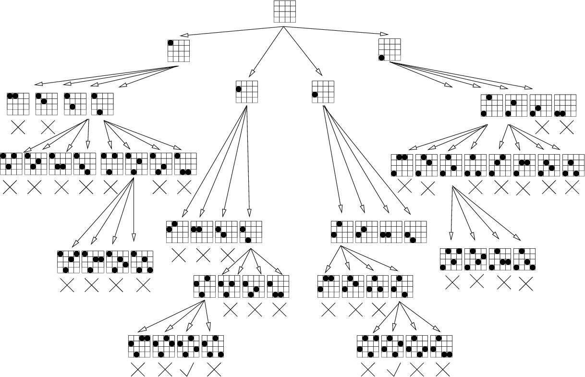

# 백트래킹

## 정의

> 되추적은 임의의 집합에서 주어진 기준 혹은 조건 대로 원소의 순서를 선택하는 문제를 푸는데 사용된다.
>

### 요약
* DFS와 기본 구조 동일, BUT 완전 탐색을 하진 않음.
* 유망한 노드를 탐색하여 가지치기하여 최종해를 찾음.
* 가장 마지막으로 성공한 탐색 결과로 되추척.


## N-Queens Problem

체스 게임에서 N개의 퀸이 NxN의 장기 판안에서 체스 규칙을 준수 하면서 서로 잡아 먹히지 않게끔 배치하는 위치시기는 문제이다.

* 어떤 여왕말 끼리도 같은 행이나 열, 대각선 상에 위치 할수 없다.
* 집합은 서양 장기판에서 말을 둘수 있는 n^2개의 위치이다.
* 기준은 어떤 여왕말도 서로 잡아먹히면 안된다.
    cf. 기존 체스 룰에서 여왕은 동일 경로 가로,세로 혹은 대각선 상에 있는 말을 잡을수 있다.
* 순서는 여왕말들으 둘 n개의 각각 다른 위치이다.
    cf. 원래의 서양 장기판은 8x8이지만 편의상 4x4로 정의한다.

### 완전 탐색 해법

위에서 정의 했던 기준을 고려 하면 문제를 간단하게 만들수 있다. 
각 여왕말들을 다른 곳에 배치후 각 여왕말이 어떤 열에 놓이면 해답이되는지 검사해 보면된다.

`예시`
```shell
1000 -> Row 1
0000 -> Row 2
0000 -> Row 3
0000 -> Row 4
```
위의 배치 처럼 1행의 여왕말을 배치후 같은 행 혹은 열에 여왕을 배치할수 없으므로,
후에 배치되는 여왕말들은 각 행마다 존재 해야 하기 때문에 최종적으로는 각 행의 열만 검사해 주면 된다.

여기서 경우의 수를 예상해 볼수 있다.
4행의 정방행렬이므로 한 행에 하나의 여왕말만 존재 할수 있으므로 그 가지수는 4x4x4x4=256개가 존재한다.

만약 DFS로 풀이 했다면 256개의 경우의 수를 전부 검사 해야 하는 불상사가 발생할지도 모른다.

### 되추적 해법

위의 방법대로 해도 해를 찾는 것이 불가능한것은 아니다.
하지만 유한한 자원으로 빠르고 정확하게 해를 찾아야 자원을 아낄수 있고 이는 곧 회사의 지출로 직결된다.
때문에 조금더 해법을 빠르게 찾기위해 하나의 과정을 추가한다.

`유망한 노드`
백트래킹이 DFS와의 다른점은 유망한 노드의 검사를 통해 나머지 자식노드들로 탐색을 선택할 수 있는것이다.

예를 들어 보자
```shell
1000
0100
0000
0000
```
위의 배치처럼 <1,1>에 말이 존재하고  <2,2> 을 탐색한다고 가정하자.
DFS의 탐색을 적용하면 해당 노드부터 모든 자식노드로 이어지는 길을 탐색할것이다.
즉, <2,2> 에서 부터 4x4=16 가지의 노드를 탐색하는것이다.

하지만 애초에 <2,2>는 기준상 불가능한 배치이다.
그렇다면 이후에 탐색되는 자식노드들은 탐색할 필요성이 사라지는것이다.
여기서 되추적이 적용된다.
<2,2> 는 **유망하지** 않은 노드이므로 부모 노드인 <1,1>로 되돌아와서 그다음 자식 노드인 <2,3>을 탐색 하는것이다.
이런 과정을 트리 구조에서 가지친다 라고 정의한다.

#### 유망한 노드 체크 최적화

```c
if(col[i]==col[k])
if(col[k]-col[i]==k-i)
```

#### Pruned state space tree



### 백준 문제

[백트래킹 카테고리](https://www.acmicpc.net/problem/tag/백트래킹)

[9663](https://www.acmicpc.net/problem/9663)